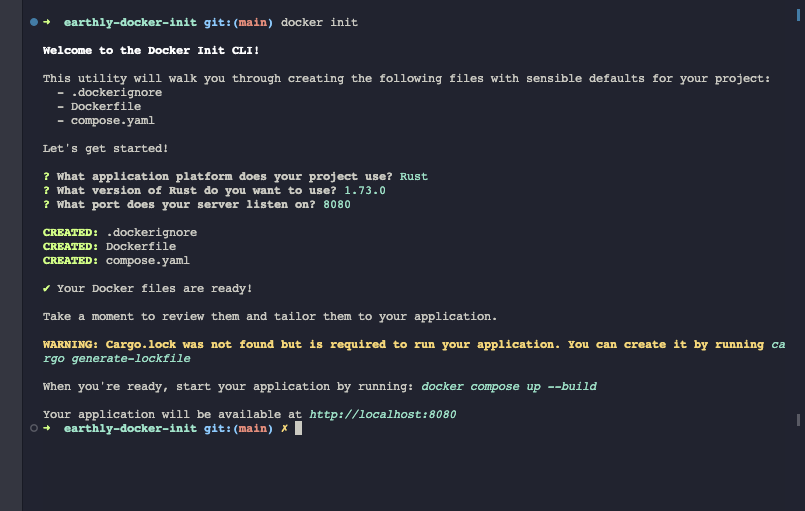

  

# Using Docker Init with Rust

## Overview
This article provides a comprehensive guide on how to use Docker Init for Rust projects. It covers the benefits of Docker Init, particularly for streamlining the setup of containerized environments in Rust development.

## Key Topics
- Introduction to Docker Init and its relevance in Rust projects
- Detailed explanation of Docker Init and its functionalities
- Step-by-step guide on implementing Docker Init in Rust
- Insights into the generated Docker files and their purposes
- Practical examples and code snippets

## Audience
This article is intended for Rust developers, especially those looking to integrate Docker into their development workflow.

## How to Use This Guide
- Read through each section to understand the role and benefits of Docker Init in Rust.
- Follow the step-by-step instructions to implement Docker Init in your Rust projects.
- Refer to the code samples and explanations to customize Docker files for your specific needs.

## Feedback and Contributions
Your feedback is valuable to us. If you have any suggestions or contributions to improve this guide, please feel free to submit an issue or pull request.